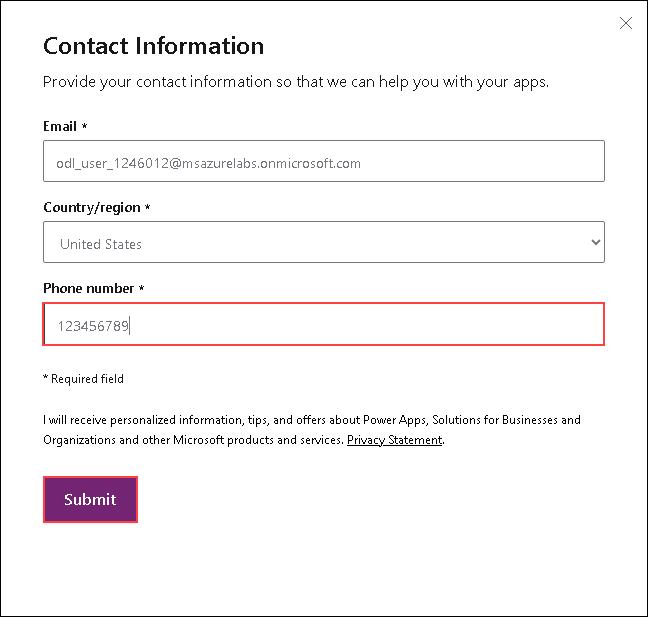

# Getting Started with Lab

1. Once the environment is provisioned, a virtual machine (JumpVM) and lab guide will get loaded in your browser. Use this virtual machine throughout the workshop to perform the lab. You can see the number on the lab guide bottom area to switch to different exercises of the lab guide.
   

   .png "Lab Environment")

1. To get the lab environment details, you can select the **Environment** tab. Under **Environment** tab, you can choose **Azure Credentials** or **Service Principal** based on what credentials you want to use. Additionally, the credentials will also be emailed to your email address provided during registration. Also, you can start, stop, and restart virtual machines from the **Resources** tab.

   .png "Lab Environment")

   .png "Lab Environment")

    > You will see the SUFFIX value on the **Environment Details** tab, use it wherever you see SUFFIX or Deployment ID in lab steps.

1. 1. You can also open the Lab Guide in a separate and full window by selecting the **Split Window** from the top right corner.

    

1. Please note if you are starting with the lab from any particular steps then below is the details on the same with mentioning of exercise along with the lab.

   * OpenAI Natural Language Query lab start from **Exercise 1: Build an Open AI Application on Power App to allow users to use natural language questions on top of SQL data**
   * OpenAI Batch Pipeline starts from **Exercise 2: Build an Open AI Pipeline to Ingest Batch Data, Perform Intelligent Operations, and Analyze in Synapse**
   * OpenAI on Custom Dataset start from **Exercise 3: Using Azure OpenAI on custom dataset**
   * OpenAI with PowerApp and Python starts from **Exercise 4a: Build Open AI application with Power App** and **Exercise 4b: Build Open AI application with Python**
  
  You can directly navigate to the required exercise to start with the choice of your lab.

## Login to Azure Portal

1. In the JumpVM, click on the Azure portal shortcut of the Microsoft Edge browser from the desktop.

   .png "Lab Environment")

1. In the Welcome to Microsoft Edge page, select **Start without your data**, and on the help for importing Google browsing data page select **Continue without this data** button and proceed to select **Confirm and start browsing** on the next page.
   
1. On the **Sign in to Microsoft Azure** tab you will see a login screen, enter the following email/username and then click on **Next**. 
   * Email/Username: <inject key="AzureAdUserEmail"></inject>
   
     
     
1. Now enter the following password and click on **Sign in**.
   * Password: <inject key="AzureAdUserPassword"></inject>
   
     
     
1. If you see the pop-up **Stay Signed in?**, click No

1. If you see the pop-up **You have free Azure Advisor recommendations!**, close the window to continue the lab.

1. If a **Welcome to Microsoft Azure** popup window appears, click **Maybe Later** to skip the tour.
   
1. Now you will see Azure Portal Dashboard, click on **Resource groups** from the Navigate panel to see the resource groups.

    
   
1. Confirm you have a resource groups present as shown in the below screenshot. The last six digits in the resource group name are unique for every user.

    
   
1. Now, click on Next from the lower right corner to move to the next page.
