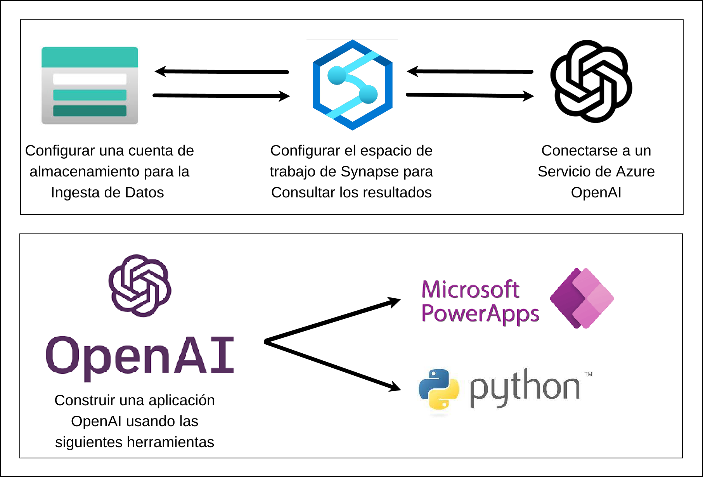

# Use Azure Open AI like a Pro to build powerful AI Applications

### Overall Estimated Duration: 8 hours

## Overview

These hands-on labs provide comprehensive training on integrating OpenAI capabilities into various applications and environments. They cover building pipelines in Azure Synapse for batch data processing and intelligent operations, creating applications with Power Apps and Python that leverage OpenAI's APIs for tasks like natural language processing and data analysis, and exploring advanced topics such as prompt engineering and model fine-tuning using Azure OpenAI Studio. The read-only sections offer theoretical insights into advanced concepts, fine-tuning techniques, hyperparameters in Azure OpenAI Service, and a glossary for understanding key terms and concepts. Together, these labs aim to equip participants with practical skills and theoretical knowledge necessary to effectively utilize OpenAI technologies across different platforms and applications.

## Objective

The lab will include the following exercises: 

1. **Build an Open AI Pipeline to Ingest Batch Data, Perform Intelligent Operations, and Analyze in Synapse:** Develop a pipeline to integrate OpenAI for batch data ingestion, intelligent operations, and analysis within Azure Synapse.
   
1. **Build an Open AI application with Power App:** Create an application using Power Apps that integrates OpenAI capabilities for tasks like natural language understanding or data processing.
   
1. **Build an Open AI application with Python:** Build applications using Python to leverage OpenAI's APIs for tasks such as language generation, sentiment analysis, or recommendation systems.

1. **Introduction to Prompt Engineering & Azure OpenAI Studio:** Learn techniques for crafting effective prompts and utilize Azure OpenAI Studio for developing and deploying AI models.

1. **Advanced Concepts (Read-Only):** Explore advanced theoretical knowledge and practical applications related to OpenAI technologies and their implementations.

1. **Fine Tuning (Read-Only):** Understand and practice fine-tuning OpenAI models to improve performance on specific tasks or datasets.

1. **Basic Overview of Azure OpenAI Service Hyperparameters (Read-Only):** Gain foundational understanding of hyperparameters in Azure OpenAI Service and their impact on model training and performance.

1. **Glossary (Read-Only):** Access definitions and explanations of key terms and concepts essential for understanding OpenAI and Azure OpenAI Service.

## Prerequisites

Participants should have: 

- Proficiency in Python programming language, including libraries like Pandas for data manipulation and Flask for web application development.
- Experience with Microsoft Power Apps or similar low-code platforms for application development and integrating APIs.
- Basic understanding of machine learning concepts such as model training, deployment workflows, and RESTful APIs.
- Understanding of AI concepts such as natural language processing, model fine-tuning, and hyperparameter optimization.

## Architecture

These labs utilize Azure Synapse for data integration and analytics pipelines, Power Apps for intuitive Open AI application development, Python for AI-driven solutions using OpenAI APIs, and Azure OpenAI Studio for model development with prompt engineering. Read-only modules cover advanced AI concepts, fine-tuning, hyperparameters, and a glossary, providing foundational knowledge. Participants gain practical skills in leveraging OpenAI effectively across various applications within Azure environments.

## Architecture Diagram

## Explanation of Components

The architecture for this lab involves several key components:

- **Storage Account:** Provides a secure and scalable cloud storage solution for storing data objects, such as files, blobs, and unstructured data.
- **Synapse Workspace:** Azure Synapse Analytics is an integrated analytics service that combines big data and data warehousing capabilities. The workspace allows for seamless collaboration between data engineers, data scientists, and analysts.
- **Azure Open AI Service:** Provides access to OpenAI's powerful AI models through Azure, enabling integration into applications for natural language processing, text generation, and more.
- **Microsoft Power Apps:** A low-code platform that allows users to build custom business applications without extensive coding knowledge.
- **Prompt Engineering:** Involves crafting specific prompts or queries to elicit desired responses from AI models, influencing the output and behavior of AI systems.

This hands-on lab aims to empower participants in leveraging OpenAI technologies within Azure environments, spanning data ingestion, application development, prompt engineering, model optimization, and theoretical AI concepts for comprehensive learning and application.

### Happy Learning!!
