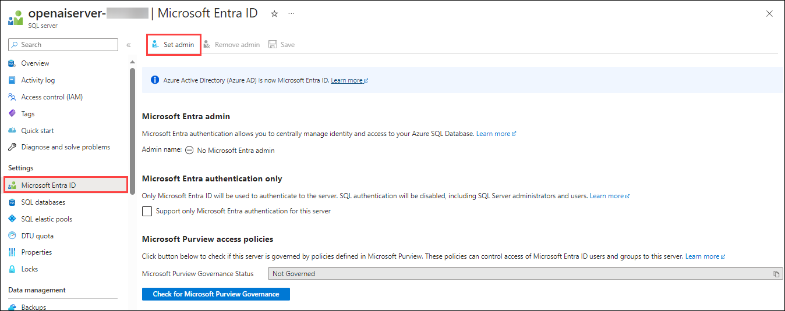
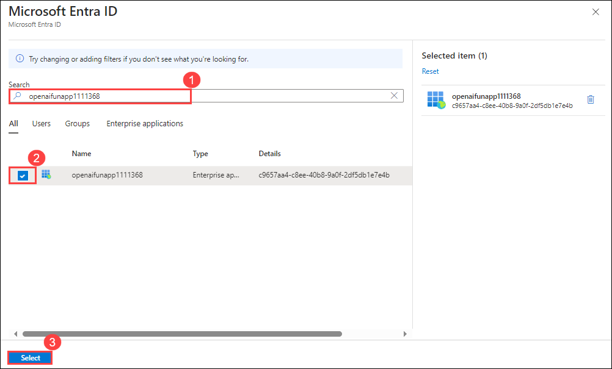
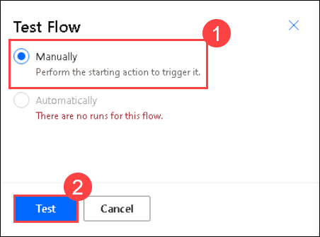

# Exercise 1: Build an Open AI Application on Power App to allow users to use natural language questions on top of SQL data
### Summary

This scenario allows users to use Open AI as an intelligent agent to get business question prompts from end users and generate SQL queries from the prompts. This implementation scenario focuses on building a Natural Language to query from business questions and generate the queries for database retrieval.
### Architecture Diagram


### Solution Flow

Step 1: Context information is provided to the system through a Power App form, this information is submitted to Azure function.

Step 2: Azure Open AI engine converts the user context prompt to SQL query and passes the query to Azure function.

Step 3: Azure function passes the context information to Open AI Engine to convert the user context information prompt to SQL Query.

Step 4: The Azure function passes the generated SQL query text and executes the query on the Azure SQL database. 

Step 5: The query is executed on the SQL database and results are returned to the Azure function.

Step 6: The Azure function returns the results to the end user.
### Azure services deployment
   
## Task 1: Deploy Azure OpenAI Model and Configure Azure Function App.

1. In the **Azure portal**, search for **OpenAI** and select **Azure OpenAI**.

   

1. On **Cognitive Services | Azure OpenAI** blade, select **openai-<inject key="DeploymentID" enableCopy="false"/>**

   

1. In the Azure OpenAI resource pane, click on **Go to Azure OpenAI Studio** it will navigate to **Azure AI Studio**.

   

1. In the **Azure AI Studio**, select **Deployments** under Management and verify that two models with the corresponding **Deployment names** of **gptmodel** and **demomodel** are present and the capacity of the model is set to **15K TPM**.

   

1. Navigate back to [Azure portal](http://portal.azure.com/), search and select **Azure OpenAI**, from the **Cognitive Services | Azure OpenAI pane**, select the **OpenAI-<inject key="Deployment ID" enableCopy="false"/>**.

1. On **openai-<inject key="DeploymentID" enableCopy="false"/>** blade, select **Keys and Endpoint (1)** under **Resource Management**. Select **Show Keys (2)** Copy **Key 1 (3)** and the **Endpoint (4)** by clicking on copy to clipboard and paste it into a text editor such as Notepad for later use. 

   

1. Navigate to **openai-<inject key="DeploymentID" enableCopy="false" /></inject>** resource group, and search and select **SQL database**.

   

1. Now, copy the database name and paste it into a text editor such as Notepad for later use. 

   

1. In **openai-<inject key="DeploymentID" enableCopy="false" /></inject>** resource group, search and select **SQL server**.

   

1. Now, copy the **Server name** and paste it into a text editor such as Notepad for later use. 

   

1. Navigate to `C:\labfile\OpenAIWorkshop\scenarios\natural_language_query/azurefunc` folder and open `func-config.txt` file. Provide the **Open AI engine**, **Open AI rest endpoint**, **SQL server** and **SQL database** name in the file and copy the content.

      >**Note:** Provide the Model name as **demomodel**.

   

1. Go to **openai-<inject key="DeploymentID" enableCopy="false" /></inject> (1)** resource group and open **openaifunapp<inject key="DeploymentID" enableCopy="false" /></inject> (2)** function app.

   

1. Go to deployed function and click **Configuration** -> **Application Settings** and click on **Advance edit** and copy the **func-config.txt** values in the editor. Do not delete the existing contents in **Advance edit**, add **`,`** after last '}' before ']' and just update **config-func.txt** values following. After updating the values click **OK** and **Save**.
   
   
   
   

1. Under Settings in function click on **Identity** , under **System assigned** set the **Status** to **On**, Save the changes.

   

1. Go to SQL server **openaiserver-<inject key="DeploymentID" enableCopy="false" /></inject>** under the same resource group, under **settings**, click **Microsoft Entra ID** and click **Set admin**.

   

1. On the Microsoft Entra ID pane, In the search box enter the name of the function app **openaifunapp<inject key="DeploymentID" enableCopy="false" /></inject>**. Add the name and click **Select** and **Save**.

   
   
## Task 2. Test the function App

1. Go to **openai-<inject key="DeploymentID" enableCopy="false" /></inject> (1)** resource group and open **openaifunapp<inject key="DeploymentID" enableCopy="false" /></inject> (2)** function app.

   

2. In the **Overview (1)** page, under **Functions (2)** tab  select **NLQuery (3)**.

   

3. From NLQuery go to **Code + Test (1)**, then click **Test/Run (2)** select **GET (3)** in **HTTP method** dropdown, click **+ Add parameter** under **Query** and enter **prompt (4)** in the **Name** field and enter **show top 10 products (5)** in the **Value** field. Click **Run (6)**.

   

4. The **Output** tab will have the query results and click on **Close** to close the output results.

   
  
   >**Note:** Please press the Run again if the output tab does not print the records


## Task 3. Deploy client Power App

1. Navigate to https://make.powerapps.com/. Select **Apps (1)** on the left navigation and click on **Import Canvas App (2)**. 

    
    
  >**Note:** Please click on **Start a free Trial** if you get any pop-up stating **You need a Power Apps Plan**.

2. On the **Import package** page click on **Upload**.

    

3. From the file explorer navigate to `C:\labfile\OpenAIWorkshop\scenarios\natural_language_query` select the **NLQuery PowerApp Export** folder and click on **Open**.

     

4. Click on **Import** to import the package into the PowerApps environment. This will import the Power App canvas app and Power Automate Flow into the workspace. 

    

5. Navigate back to **openai-<inject key="DeploymentID" enableCopy="false" /></inject> (1)** resource group and open **openaifunapp<inject key="DeploymentID" enableCopy="false" /></inject> (2)** function app.

   

6. On the **Overview (1)** blade of function app, click on **Functions (2)** and click deployed function **NLQuery (3)**.

   

7. On the **NLQuery** function click on **Get Function Url (1)**, from the drop-down menu select **default (function key) (2)** then **Copy (3)** the URL, Click **OK (4)**. Paste the URL in a text editor such as _Notepad_ for later use.

    

8. On the **Flows (1)** Pane, select **PromptlnputFlow (2)** then click on **... (3)** and **Turn on (4)** your flow.

    

9. Next, select the **PromptInputFlow (1)** and click on **Edit (3)** for **PromptlnputFlow**.

    
 
10. Edit the Power Automate Flow and update **Azure Function Url (1)** with the URL you copied earlier and append `prompt=` at the end. Your URL should look like the following. Click **Save (2)**.

    ```
    https://openaifunappXXXXXX.azurewebsites.net/api/NLQuery?prompt=
    ```
  
      

11. Got to **Apps** and select the app with the name **NLP Query**. Run the App by clicking on the App.

      

      


## Task 4. Build the Connector App

1. Navigate to https://make.powerapps.com/ and click on **App launcher** on the top left corner and select **Power Automate**.

     

1. On the **Power Automate** page, click on **More (1)** and select **Discover all (2)**.

   

1. Click on **Custom Connectors** under the Data.

   

1. Select **Custom Connectors (1)**, click on **+ New custom connector (2)** then click on **Create from blank (3)**. Just keep the screen as it is and move to the next step.

    
   
4. Enter the **Connector name** as `Openai-custom-connector` **(1)** and click on **Continue (2)**. Just keep the screen as is and move to the next step.

      
   
   >**Note:** Please click on **Start Trial** if you get any pop-up to register.
   
5.  From the file explorer navigate to `C:\labfile\OpenAIWorkshop\scenarios\natural_language_query` and open **get-prompt.txt**.

     

6. We need to update the below values in the file 

      - **host**: **openaifunapp<inject key="DeploymentID" enableCopy="false" /></inject>.azurewebsites.net (1)**
  
      - **paths**:  **/api/NLQuery (2)**
  
      - **operationId**: **Get-Prompt (3)**

      
  
   >**Note:** host and paths are extracted from your function URL and can be retrieved from the below screen. The host should not have "Https", please note that operationid needs to be unique per powerapps account
 
      
     


7. In the Custom Connector app browser tab, click on **Start trial**. 
   
   
   
8. Click on **Swagger Editor (1)** and copy the updated file contents from **get-prompt.txt** **(2)** and replace with the content in the **Swagger editor(2)**. Click **Create Connector (3)**.

   
   
9. Navigate to https://make.powerapps.com. click on **Flows**, select the flow which you imported in the previous task and click **Edit**.

   

11. We will update the power automate flow second step after **PowerApps(V2)**, click on **+ (1)** and select **Add an action (2)**.
  
   
  
11. Select **Custom (1)** and type `Openai-custom-connector` **(2)** in search and select the custom connector which you created previously **(3)**.
  
    

12. The flow will look like the image provided below.
  
     
  
13. You need to delete the third step which in your case will be **HTTP** flow, click on `...` **(1)** next to **HTTP** and click **Delete (2)**.

     

14. Click the **Parse JSON** step , click inside the **Content (1)** field, click on right side, and select **body (2)**. 
  
     
  
15. The Control should be like the below. Click **Save**.

     
 
16. Click on **Flows** and select the flow that you imported in the previous task and click **Edit** then on **Test**.
    
    
    
17. Select **Manually (1)** and **Test (2)**. 

    

18. Click on **Continue** for **Run flow**.

    
 
19.  Under **txtPrompt** enter **Run connector App (1)** and click **Run flow (2)**.

     

20. Once you receive **Your flow run successfully started**, click on **Done**. 
   
    

21. To monitor the run, go to the **Flows** Page and view the recent run history.
   
    
   
22. From the **Apps (1)** tab, select the **NLP Query** click `...` **(2)**  then click **Edit (3)**.
   
     
     
23. Click on **Power Automate**, then click on `...` next to **Logic flows** and click on **Remove from app**.

      

24. Next, click on **+ Add flow** and select **Promptinputflow**.
  
      
 
 25. Click **Save** on the top right.
 
     
 

## Task 5. Test the Power App

1. Navigate to https://make.powerapps.com/ and click on Apps on the left navigation. Open the **NLP Query** App.

    
    
1. Click on **Submit** to see the products.

    


