# Exercício 1: Usar Open AI para Inserir dados em Bulk, Executar Operações Inteligentes, e Analisar Dados com Synapse

### Sumário

This scenario allows the use of OpenAI to summarize and analyze customer service call logs for the fictitious company, Contoso. The data is ingested into a blob storage account and then processed by an Azure function. The Azure Function will return the customer sentiment, the product offering the conversation was about, the topic of the call, as well as a summary of the call. These results are written in a separate, designated location in the blob storage. From there, Synapse Analytics is utilized to pull in the newly cleansed data to create a table that can be queried to derive further insights.

---
# Índice
- [Usar Open AI para Inserir dados em Bulk, Executar Operações Inteligentes, e Analisar Dados com Synapse](#build-an-open-ai-pipeline-to-ingest-batch-data-perform-intelligent-operations-and-analyze-in-synapse)
- [Sumário](#summary)
- [Índice](#table-of-contents)
- [Diagrama de Arquitetura](#architecture-diagram)
- [Implantação](#deployment)
    - [Tarefa 1. Inserir Dados no Storage criado no passo 1](#step-1-Ingest-Data-to-Storage-account)
    - [Tarefa 2. Configurar o Synapse Workspace](#step-3-set-up-synapse-workspace)
        - [a. Lançar o Azure Cloud Shell](#a-launch-azure-cloud-shell)
        - [b. No Cloud Shell execute os seguintes comandos:](#b-in-the-cloud-shell-run-the-below-commands)
        - [c. Criar tabela SQL de destino](#c-create-target-sql-table)
        - [d. Criar a Origem e Destino em Linked Services](#d-create-source-and-target-linked-services)
        - [e. Criar Fluxo de dados em Synapse](#e-create-synapse-data-flow)
        - [f. Criar um Pipeline em Synapse](#f-create-synapse-pipeline)
        - [g. Executar um Pipeline em Synapse](#g-trigger-synapse-pipeline)
    - [Tarefa 3. Resultados da Consulta na Nossa Tabela SQL ](#step-4-query-results-in-our-sql-table)


# Diagrama de Arquitetura

   

Os registros de chamadas são enviados para blob storage. Este envio aciona um Azure Functions, que usa o [Azure OpenAI Service](https://azure.microsoft.com/en-us/products/cognitive-services/openai-service/) para a sumarização, análise de sentimento, identificar o produto discutido na conversa, o tópico da chamada, bem como um resumo da chamada. Esses resultados são escritos novamente em blob storage. A partir daí, o Synapse Analytics é utilizado para importar os novos dados e criar uma tabela que pode ser consultada para obter mais Informações.

## Tarefa 1: Inserir Dados em Storage account

### A. Lançar o Azure Cloud Shell

1. No [Portal de Azure](https://portal.azure.com?azure-portal=true), selecione o botão **[>_]** (*Cloud Shell*) que se encontra no topo da página a direita da pesquisa. O painel do Cloud Shell irá abrir na parte inferior do portal.

    

2. Na primeira vez que abrir o Cloud Shell, pode ser solicitado que escolha o tipo de shell que deseja usar (*Bash* ou *PowerShell*). Selecione **Bash**. Se esta opção não abrir pode avançar para o próximo passo.

3. No painel Getting Started, selecione **Mount storage account (1)**, selecione **Storage account subscription (2)** na lista de opções e selecione **Apply (3)**.

   .png)

4. No painel **Mount storage account**, selecione **Select existing storage account (1)** e clique **Next (2)**.

   .png)

5. No painel **Advanced settings**, introduza os seguintes detalhes:

    - **Subscription**: Default- Escolha a única assinatura existente atribuída para este laboratório. (1).
    - **Resource group**: Selecione **Use existing** **(2)**
      - openai-<inject key="DeploymentID" enableCopy="false"></inject>
    - **Storage account**: Selecione **Use existing** **(3)**
      - openaistorage<inject key="DeploymentID" enableCopy="false"></inject>
    - **File share**: Create a new file share **(4)**

      .png)

1. Introduza o nome para a file share **blob (1)**, e selecione **Select (2)**.

    .png)

1.  Assim que a storage account for criada, a janela Bash será exibida, conforme mostrado na capura de tela abaixo.
    
    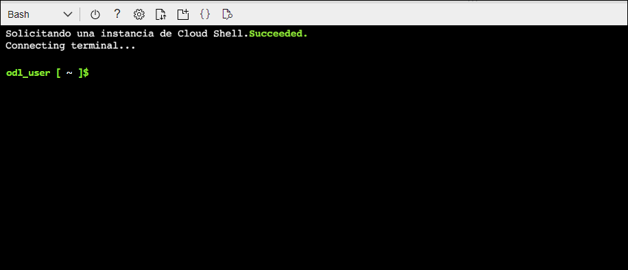

### B. Carregar arquivos para a storage account:

1. Execute os seguintes comandos no Cloud Shell para fazer download e instalar o Miniconda. 

     ```bash 
     wget https://repo.anaconda.com/miniconda/Miniconda3-py39_23.1.0-1-Linux-x86_64.sh 
     ```

     ```bash 
     sh Miniconda3-py39_23.1.0-1-Linux-x86_64.sh 
     ```
    
    > **Nota:** Os seguintes comandos são executados em Bash; certifique-se de que está a usar **Bash** na Cloud Shell.
    
    > **Nota:** Pressione a tecla de seta para baixo para ler ou ignorar o acordo de licença.

1. Digite **yes** e pressione **enter** para aceitar o acordo, e pressione enter para instalar na pasta padrão.

   

1. Digite **yes** e pressione **enter** para inicializar o ambiente conda.

    

1. Execute o seguinte comando para armazenar o caminho de instalação do miniconda em uma variável.

    ```bash 
    export PATH=~/miniconda3/bin:$PATH
    ```
1. Execute o seguinte comando para criar e ativar o ambiente conda na Cloudshell.

    ```bash 
    git clone https://github.com/microsoft/OpenAIWorkshop.git
    cd OpenAIWorkshop/scenarios/openai_batch_pipeline/document_generation
    conda create -n document-creation
    conda activate document-creation
    pip install --upgrade pip
    pip install -r reqs.txt
    ```
    > **Nota**: se receber o erro **"Conda: command not found"**, feche a sessão de CloudShell e abra uma nova sessão para continuar.
    
1. Digite **y** e pressione enter para prosseguir.

1. No [Portal de Azure](https://portal.azure.com), navegue para a Storage Account com o sufixo `functions` selecionando o **openai-<inject key="DeploymentID" enableCopy="false"/>** resource group e selecione a Storage Account da lista de recursos.

    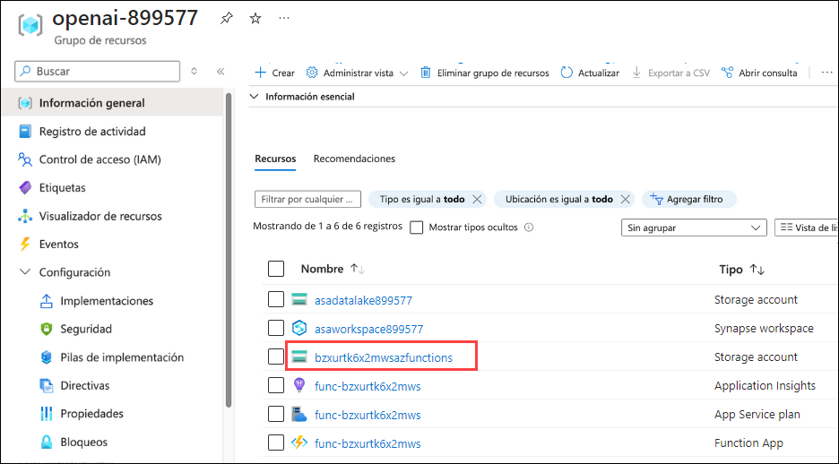
    
1. Mude para a janela **Access keys (1)** e selecione **Show (2)**, que está ao lado do valor da Connection String. Selecione o botão de copiar para a primeira **connection string (3)**. Cole o valor em um editor de texto, como o Notepad.exe, para referência futura."

   

1. Volte para a sessão Bash da Cloud Shell e execute o comando abaixo para fazer o upload dos arquivos JSON para a storage account, substituindo a <CONNECTION_STRING> copiada na etapa anterior. Este passo irá demorar alguns minutos para ser concluído.

    ```bash 
    python upload_docs.py --conn_string "<CONNECTION_STRING>"
    ```

   

   > **Nota**: Execute "cd OpenAIWorkshop scenarios/openai_batch_pipeline/document_generation" se não estiver na pasta OpenAIWorkshop/scenarios/openai_batch_pipeline/document_generation.

1. Depois de fazer o upload dos arquivos JSON para a storage account com sucesso, pode navegar até a storage account no portal de Azure e verificar se os arquivos foram carregados.   

   

## Tarefa 2: Configurar o Synapse Workspace

### **A. Criar tabela SQL de destino**

1. No [Portal de Azure](https://portal.azure.com), navegue até ao synapse workspace **asaworkspace<inject key="DeploymentID" enableCopy="false"/>**  no resource group **openai-<inject key="DeploymentID" enableCopy="false"/>**. Na aba **Overview**, clique em **Open** para iniciar o Synapse workspace.

    

1. Clique na secção **Develop (1)** no Synapse Studio, clique em **+ (2)** sign in no topo esquerdo, e selecione **SQL script (3)**. Isto abrirá uma nova janela com um editor de script SQL. 

   

1. Copie e cole o seguinte script no editor **(1)**, em seguida, altere o valor **Connect to** selecionando **openaisql (2)** a partir da lista suspensa, e para **Use database**, confirme que **openaisql (3)** está selecionado, e clique no botão **Run (4)** no canto superior esquerdo, como mostra a imagem abaixo. Conclua esta etapa pressionando **Publish all (5)** logo acima do botão **Run** para publicar nosso trabalho até agora.

    ```SQL 
    CREATE TABLE [dbo].[cs_detail]
    (
    interaction_summary varchar(8000),
    sentiment varchar(500),
    topic varchar(500),
    product varchar(500),
    filename varchar(500)
    )
    ```
    
    
    
1. Em seguida, clique em **Publish** para publicar o script SQL.

    

### **B. Criar a Origem e Destino em Linked Services**

Em seguida, precisaremos criar dois linked services: um para nossa origem (os arquivos JSON no Data Lake) e outro para o Banco de Dados SQL Synapse que contem a tabela que criamos na etapa anterior.

1. Click back into the **Manage (1)** section of the Synapse Studio and click the **Linked services (2)** option under the **External connections** section. Then click **+ New (3)** in the top-left.

   
   
1. Start by creating the linked services for the source of our data, the JSON files housed in the ADLS Gen2 storage we created with our initial template. In the search bar that opens after you click New, search for **blob (1)**, select **Azure Blob Storage (2)** as depicted below, and click on **Continue (3)**.

   

1. Provide the name for your linked service as **openailinkedservice (1)**. Change the **Authentication type** to **Account key (2)**. Then select the **subscription (3)** you have been working in, and finally select the storage account with the suffix **functions (4)** that you created in the initial template and loaded the JSON files into then click on **Test connection (5)**. Once the connection is successful, click the **Create (6)** button in blue on the bottom left of the New linked service window.

   

1.  Click **+ New** in the top-left. Search for **Synapse (1)**, select **Azure Synapse Analytics (2)**, and click on **Continue (3)**.

     

1. In the *New linked service* window that opens, fill in a name for your target linked service as **synapselinkedservice** **(1)**. Select the **Azure subscription (2)** for which you have been working. Select the **asaworkspace<inject key="DeploymentID" enableCopy="false"/> (3)** for **Server name** and **openaisql (4)** as the **Database name**. Be certain to change the **Authentication type** to **System Assigned Managed Identity (5)**, then click on **Test connection (6)** and click **Create (7)**.

    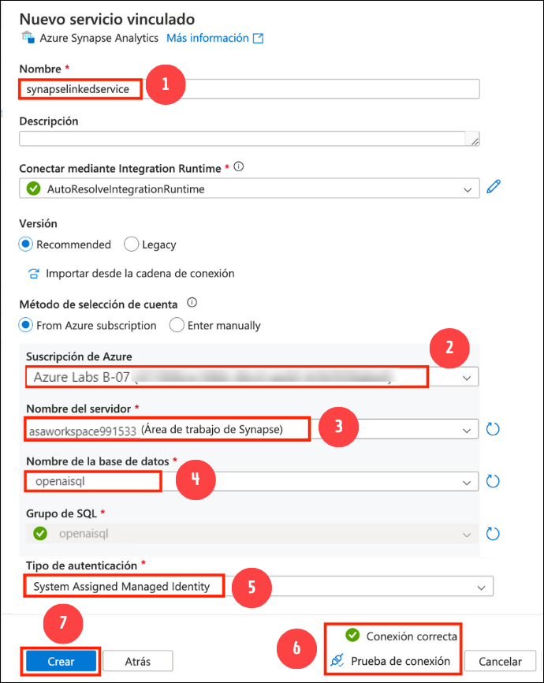

1. Once you have created the two linked services, be certain to press the **Publish all** button at the top to publish our work. Finalize the creation of the linked services and click **Publish**.

   
   
### **C. Create Synapse Data Flow**

While still within the Synapse Studio, we will now need to create a **Data flow** to ingest our JSON data and write it to our SQL database. For this workshop, this will be a very simple data flow that ingests the data, renames some columns, and writes it back out to the target table.

1. First, we'll want to go back to the **Develop (1)** tab, select **+ (2)**, and then **Data flow (3)**.

   
   
1. Once the data flow editor opens, click **Add Source**. A new window will open at the bottom of the screen. Select **+ New** on the **Dataset** row while leaving the other options as default.

   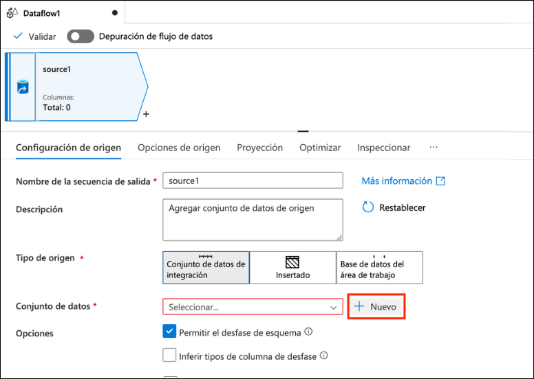

1. A new window should open on the right side of your screen. Next, search for **Azure Blob Storage (1)**, select **Azure Blob Storage (2)**, and then click on **Continue (3)**.
   
   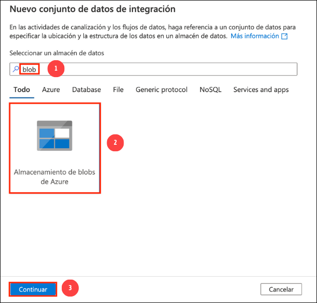

1. Next, select the **JSON (1)** option as our incoming data is in JSON format and click **Continue (2)**.

   

1. Select the Linked Service with the name **openailinkedservice (1)** we just set up in the steps above. You will need to select the proper **File path** to select the directory where our JSON files are stored. It should be something to the effect of **workshop-data / cleansed_documents (2)**. Click on the **OK** button to close the window.

   
   
1. Next, we'll need to move to the **Source options (1)** panel and drop down the **JSON settings (2)** options. We need to change the **Document form** option to the **Array of documents (3)** setting. This allows our flow to read each .JSON file as a separate entry into our database.

   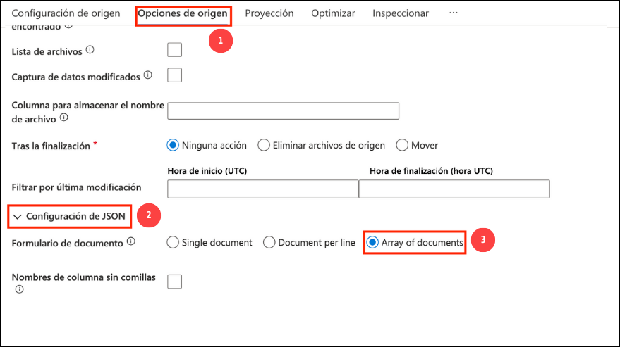   

1. Enable the toggle **data flow debug** session located at the top menu bar adjacent to the validate button, and click on **OK** on the *Turn on data flow debug* pop-up window.

    >**Note:** It will take a minute or two for the **data flow debug** session to get enabled.

1. Now head to the **Data preview** tab and run a preview to check your work thus far.
    
    

    >**Note**: If you're unable to view data under the Data Preview tab, please click on the Refresh button repeatedly until the data appears.
   
1. Next, we can add in our **Select** tile and do our minor alterations before writing the data out to the Synapse SQL table. To begin, click the small **+ (1)** sign next to our ingestion tile and choose the **Select (2)** option.

   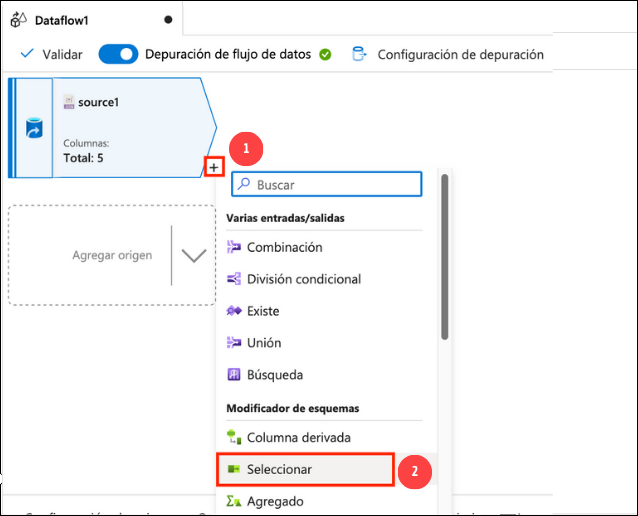

1. We can leave all the settings as defaults. Next, we'll add in our **Sink** tile. This is the step that will write our data out to our Synapse SQL database. Click on the small **+ (1)** sign next to our **Select** tile. Scroll all the way to the bottom of the options menu and select the **Sink (2)** option.

   

1. Once the **Sink (1)** tile opens, choose **Inline (2)** for the *Sink type*. Then select **Azure Synapse Analytics (3)** for the *Inline dataset type*, and for the **Linked service**, select **Synapselinkedservice (4)**, which was created in the previous step. Ensure to run **Test connection (5)** for the linked service.

   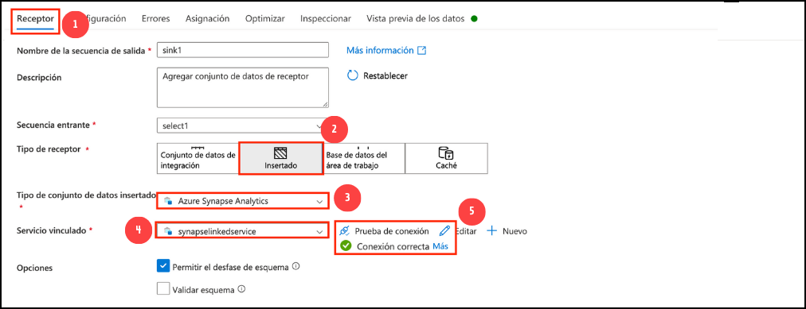

   > **Note**: If the test connection takes more than 3–4 minutes, follow the below steps.

   - Click on **Edit**.

         

   - In the Edit linked service window that opens, select the Azure selection method as **From Azure subscription** **(1)**. Select the **Azure subscription (2)** for which you have been working. Select the **asaworkspace<inject key="DeploymentID" enableCopy="false"/> (3)** for **Server name** and **openaisql (4)** as the **Database name**, and then click on **Test connection (5)** and click **Save (6)**.

     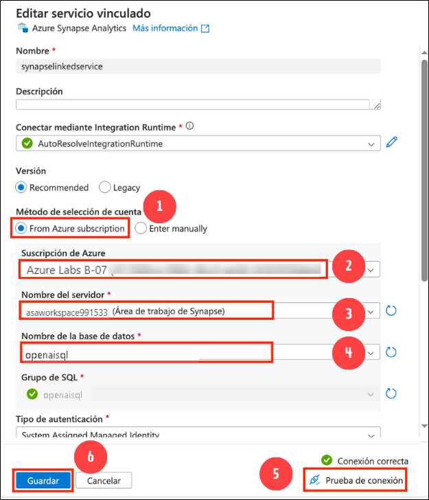

1. We will then need to head over to the **Settings (1)** tab and adjust the **Schema name** and **Table name**. If you utilized the script provided earlier to make the target table, the Schema name is **dbo (1)** and the Table name is **cs_detail (2)**.

    

1. Before we finish our work on the data flow, we should preview our data. Previewing our data reveals we only have 3 columns when we are expecting a total of 5. We have lost our Summary and Sentiment columns.

    

1. To correct this, let's use our **Select (1)** tile to change the names as follows to get the expected output values:

     - **Summary**: `interaction_summary` **(2)**
     - **CustomerSentiment**: `sentiment` **(3)**

        
    
1. If we return to our **Sink (1)** tile and under **Data preview (2)** click **Refresh (3)**, we will now see our expected 5 columns of output.

    

1. Once you have reviewed the data and are satisfied that all columns are mapped successfully (you should have 5 columns total, all showing data in a string format), we can press **Publish all** at the top to save our current configuration. A window will open on the right side of the screen; press the blue **Publish** button at the bottom left of it to save your changes.

    

1. Your completed and saved Data flow will look like the following:

    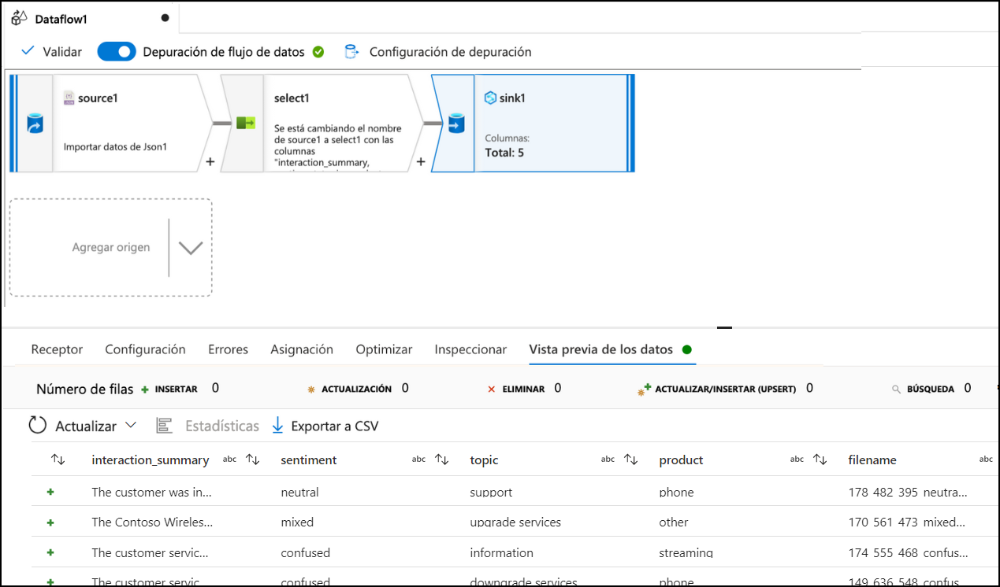

### **D. Create Synapse Pipeline**

1. Once we have created our **Data flow**, we will need to set up a **Pipeline** to house it. To create a **Pipeline**, navigate to the left-hand menu bar and choose the **Integrate (1)** option. Then click the **+ (2)** at the top of the Integrate menu to **Add a new resource** and choose **Pipeline (3)**.

   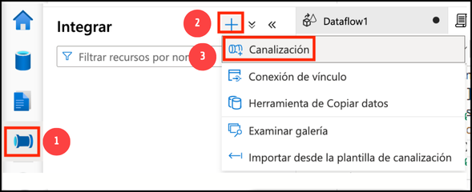

2. Next, we need to add a **Data flow** to our Pipeline. With your new **Pipeline tab (1)** open, go to the **Activities** section and search for `data` **(2)** and select **Data flow (3)** activity and **drag-and-drop (4)** it into your Pipeline.

   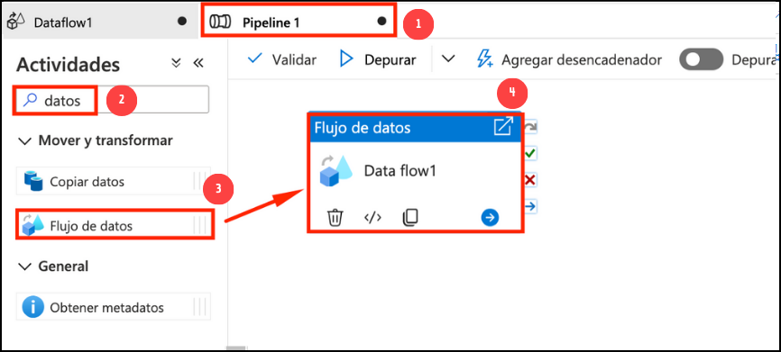

3. Under the **Settings (1)** tab of the **Data flow**, select the **Data flow (2)** drop-down menu and select the name of the data flow you created in the previous step. 
Then expand the **Staging (3)** section at the bottom of the settings and utilize the drop-down menu for the **Staging linked service**. Choose the linked service you created **openailinkedservice (4)** to ensure the **Test connection (5)**. Next, set a **Staging storage folder** at the very bottom and enter **workshop-data/Staging** **(6)**.

   

4. Then click **Publish all** to publish your changes and save your progress.

### **E. Executar um Pipeline em Synapse**

1. Depois de publicar com sucesso o seu trabalho, precisamos iniciar o nosso pipeline. Para fazer isso, logo abaixo dos separadores na parte superior do Studio, há um ícone de *raio* que diz **Add trigger (1)**. Clique para adicionar um trigger e selecione **Trigger now (2)** para iniciar uma execução de pipeline e, quando a janela abrir, clique em **OK**.

    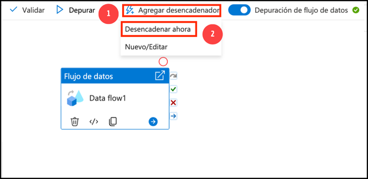
    
2. Para ver a execução do pipeline, navegue até o lado esquerdo da tela e escolha a opção **Monitor (1)**. Em seguida, selecione a opção **Pipeline runs (2)** na seção **Integration**. Em seguida, você verá a execução do pipeline que você acionou na seção **Triggered (3)** como **pipeline 1 (4)**.  Este pipeline deve levar aproximadamente 4 minutos (se você estiver usando os dados carregados para o workshop).

   

## Task 3: Resultados da Consulta na Nossa Tabela SQL

1. Certifique-se de que o status de execução do pipeline tenha **Succeeded**.

    

2. Agora que os dados estão na tabela de destino, eles estão disponíveis para uso executando consultas SQL em relação a eles ou conectando o PowerBI e criando visualizações. A Azure Function também está em execução, portanto, tente carregar alguns dos arquivos de transcrição para a pasta generated_documents em seu container e veja como a função a processa e cria um novo arquivo na pasta cleansed_documents.

3. Para consultar os novos dados, navegue até o menu do lado esquerdo e escolha **Develop (1)**. Clique no **SQL Script (2)** existente e substitua o conteúdo pelo **SQL Code (3)** abaixo. Em seguida, selecione **openaisql (4)** pool **Run (5)**. 

     ```SQL 
    SELECT sentiment, count(*) as "Sum of Sentiment"
    FROM [dbo].[cs_detail]
    GROUP BY sentiment
    ORDER BY count(*) desc     
     ```

   - Os resultados da sua consulta, se você estiver usando os arquivos carregados como parte deste repositório ou do workshop, você verá **Results (6)** semelhantes aos abaixo.

      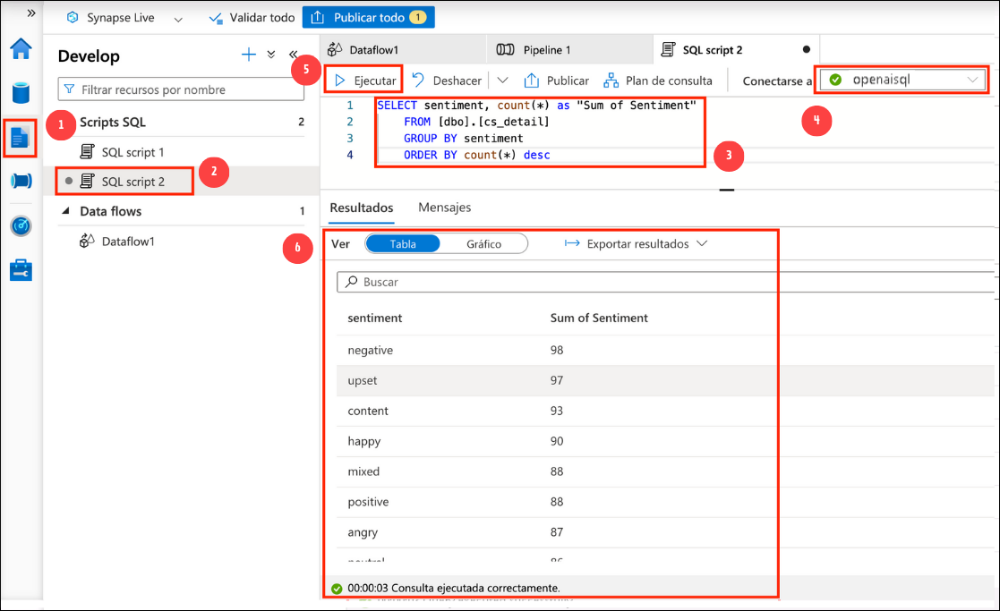
