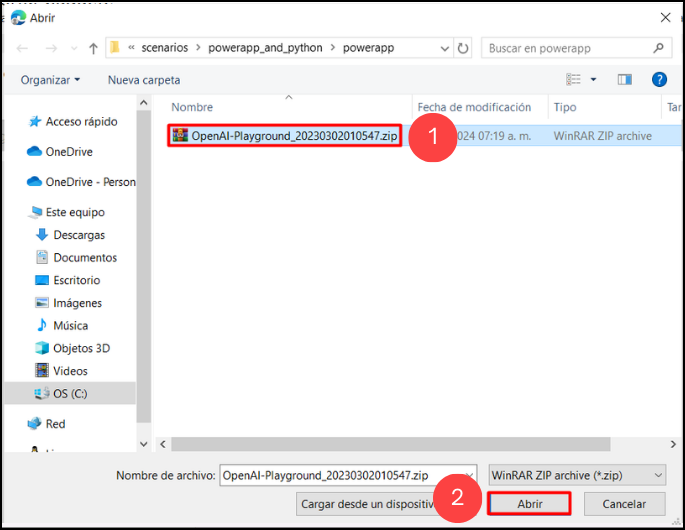
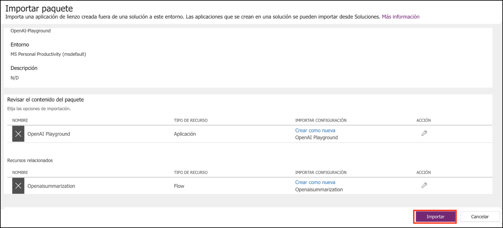
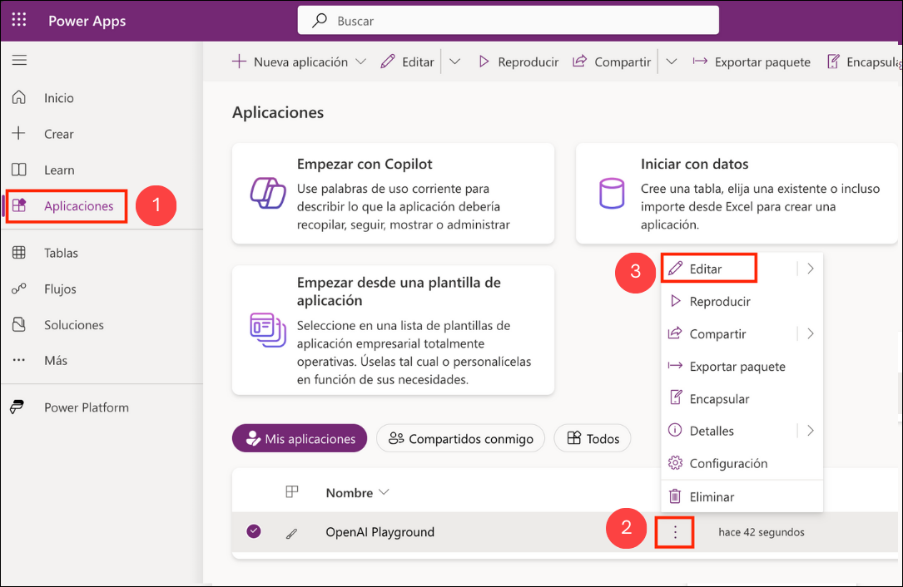
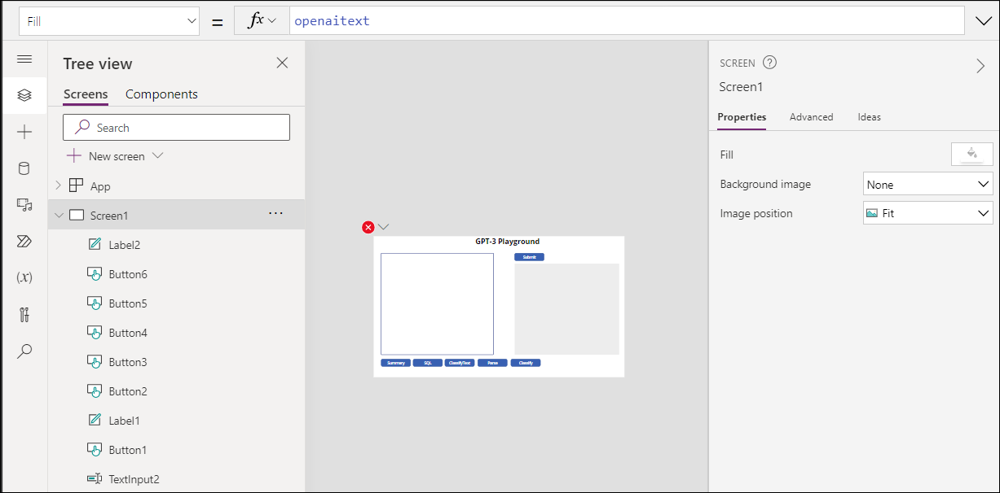
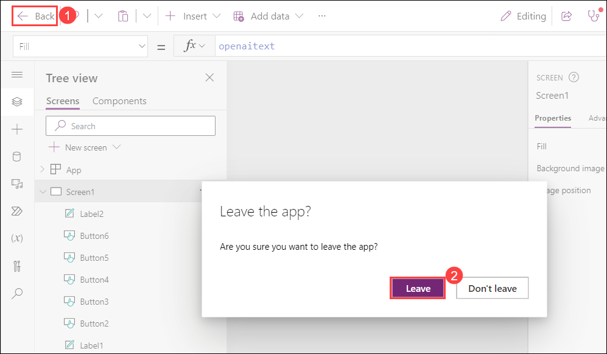
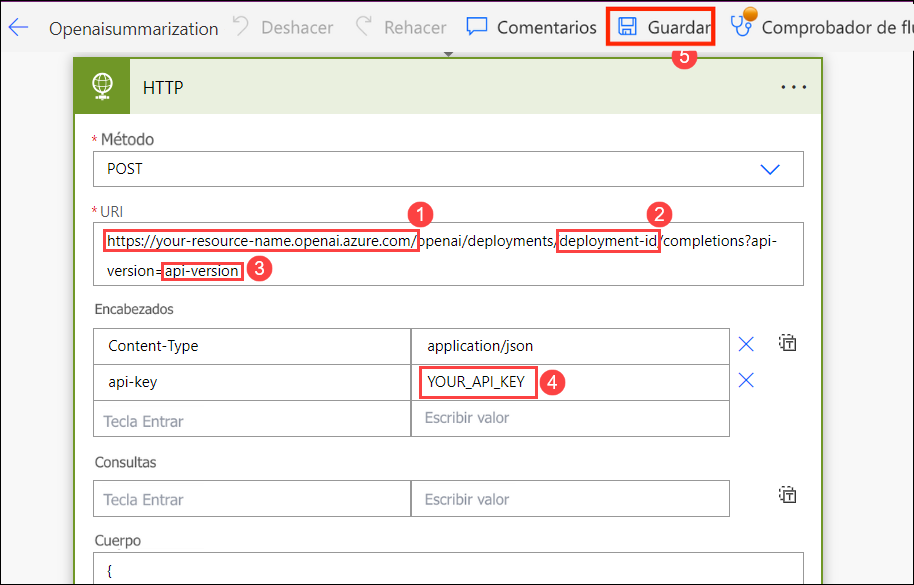
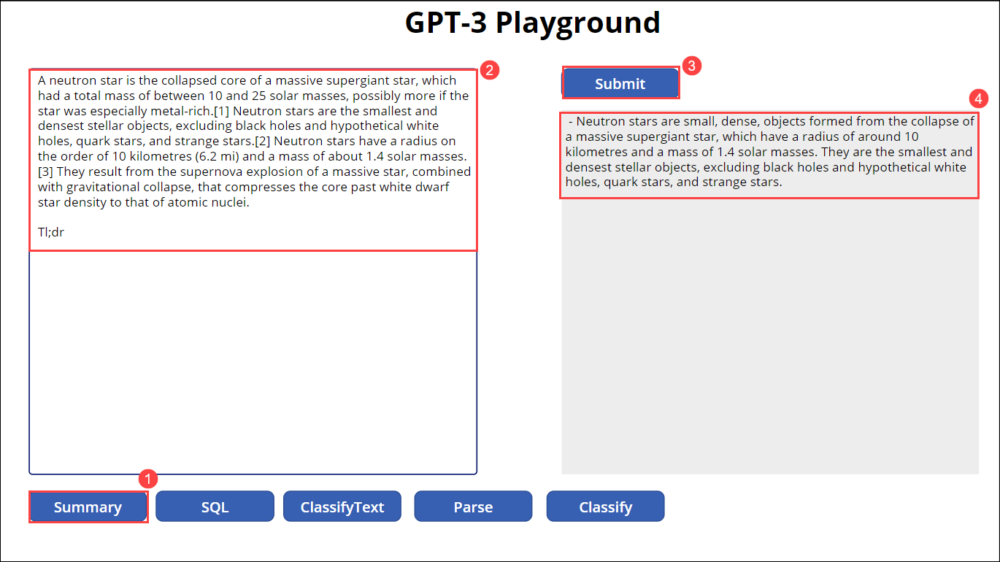

# Exercise 3: Build Open AI application with Power App 

In this exercise, you will learn how to integrate OpenAI with PowerApps. This exercise is all about combining the simplicity of PowerApp's low-code platform with the advanced capabilities of OpenAI. You'll see firsthand how these technologies can come together to create powerful applications.

1. Navigate to https://make.powerapps.com/. On **Welcome to Power Apps** select your **Country/Region (1)** click **Get Started (2)**. 

   
    
2. Select **Apps (1)** on the left navigation and click **Import Canvas App (2)**. 

    

3. On the **Import package** page click on **Upload**.

    

4. Navigate to `C:\labfile\OpenAIWorkshop-main\OpenAIWorkshop-main\scenarios\powerapp_and_python\powerapp` select the **OpenAI-Playground_20230302010547.zip (1)** folder  and click on **Open (2)**.

     

5. Once the zip file is uploaded, in the **Review Package Content** for **OpenAI Playground** click on the setup icon under **Actions**. 

     

6. In the **Import setup** pane select **Create as new (1)** from the drop-down for **Setup** and click on **Save (2)**.

      

7.  Repeat Steps 5 and 6 for **Openaisummarization**.

8. Next click on **Import** to import the package into the PowerApps environment.  

   

9. Once the import is completed, click on **Apps (1)**, then click on `...` **(2)** next to **OpenAI Playground** and click on **Edit (3)**.

      

   >**Note**: If you're unable to see the **OpenAI Playground** option, please wait for 5 minutes, and in the meantime, try refreshing the page.

10. You will observe that it has imported the Power App canvas app and the Power Automate Flow into the workspace.

      

11. To navigate back click on **Back (1)** then click **Leave (2)**.

      

12. Next, on the **Flows (1)** tab, select **Openaisummarization (2)** then click on `...` **(3)** and **Turn on (4)** your flow.

      

13. Click on **Edit (2)** for **Openaisummarization**.

      

14. Edit the Power Automate Flow HTTP step by update the **https://your-resource-name.openai.azure.com/** with **<inject key="OpenAIEndpoint" enableCopy="true"/>** **(1)**, **deployment-id** with **<inject key="openaimodulename" enableCopy="true"/>** **(2)**, **api-version** with **2023-09-15-preview** **(3)**, **YOUR_API_KEY** with **<inject key="OpenAIKey" enableCopy="true"/>** **(4)**, and click on **Save** **(5)**.

      
   
15. From the **Apps (1)** page click on the **OpenAI Playground** app to run the app by clicing on **Play (2)** button.

     

16. If you get a popup asking to start a free trial, click on **Star a Free Trial**, then on **You need a Power Apps license to use this app** window select **Start a 30-day trail**. choose your region from the drop down menu and click on **Get started** button wait for 2-3 minutes It might take to start the trial

17. In the **Canvas**, click on **Summary** **(1)** button and verify the **auto-filled text** **(2)**. Then click on **Submit** **(3)** button to get the desired **Summary** **(4)**. 

     

    > **Note**: You can try the other available options in the portal i.e, **SQL**, **ClassifyText**, **Parse**, and **Classify**.

    
**Summary:** In this exercise, You had looked into integrating PowerApps with OpenAI. You discovered how to combine the sophisticated OpenAI capabilities with PowerApp's low-code platform. 
