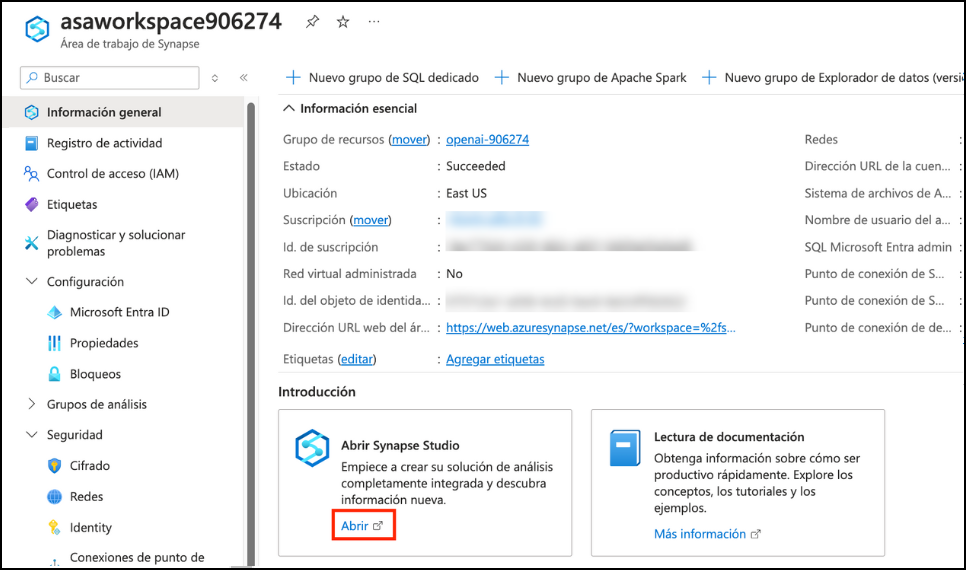
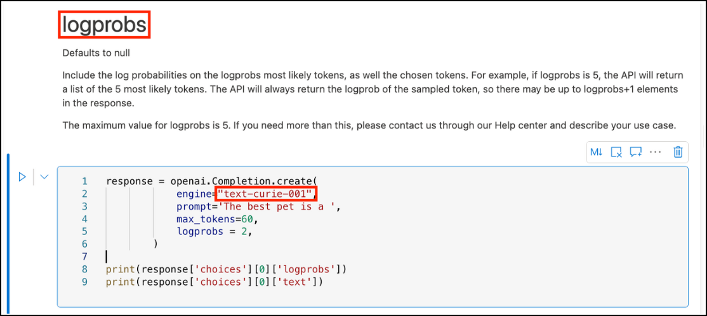

# Exercise 3: Build Open AI application with Python

1. Search and select **Azure Synapse Analytics** in the azure portal.

      

1.  On the **Overview** blade under **Getting started** section, click **Open** to open Synapse Studio.
     
    
    
1. Click on **Develop (1)** then click on **+ (2)** and select **Import**.

    

1. Navigate to `C:\labfile\OpenAIWorkshop\scenarios\powerapp_and_python\python` location and select `OpenAI_notebook.ipynb`, then click on **Open**.

     

1. Select **openaisparkpool** from the drop-down menu of **Attach to**.

    

1. Run the notebook step by step to complete this exercise. Click on **Run** button next to the cell. 

     

1. In **2. Import helper libraries and instantiate credentials** replace the **AZURE_OPENAI_API_KEY** and **AZURE_OPENAI_ENDPOINT** with your API key and Endpoint URL.

    
   
   From Azure Portal, navigate to **openaicustom-XXXXXX** Resource group, and Select Azure OpenAI resource.
    

   Under Resource Management, select **Keys and Endpoint (1)**, and click **Show Keys (2)** Copy **Key 1 (3)** and the **Language APIs (4)** and replace the **AZURE_OPENAI_API_KEY** and **AZURE_OPENAI_ENDPOINT** with your API key and Endpoint URL in the script.

    
     
    > **Note:** If you encounter an error "Openai module not found", enter `%` in before the **pip install** in the Install OpenAI cell and re-run the notebook again.

1. For **2. Choose a Model**, replace **model** value from **text-curie-001** to **demomodel**.

    

1. In **temperature**, replace **engine** value from **text-curie-001** to **demomodel**.

     

1. In **top_p**, replace **engine** value from **text-curie-001** to **demomodel**.

     

1. For **n**, replace **engine** value from **text-curie-001** to **demomodel**.

     

1. In **logprobs**, replace **engine** value from **text-curie-001** to **demomodel**.

     

1. After running the notebook successfully, click on **Publish all**.

     

1. Then click on **Publish** to save the changes. 

    
