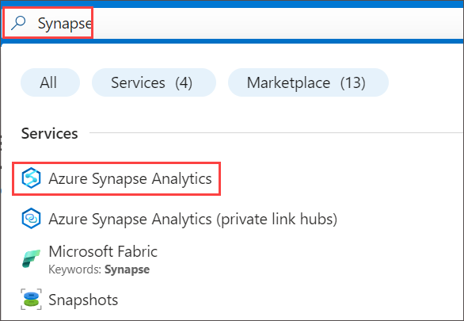
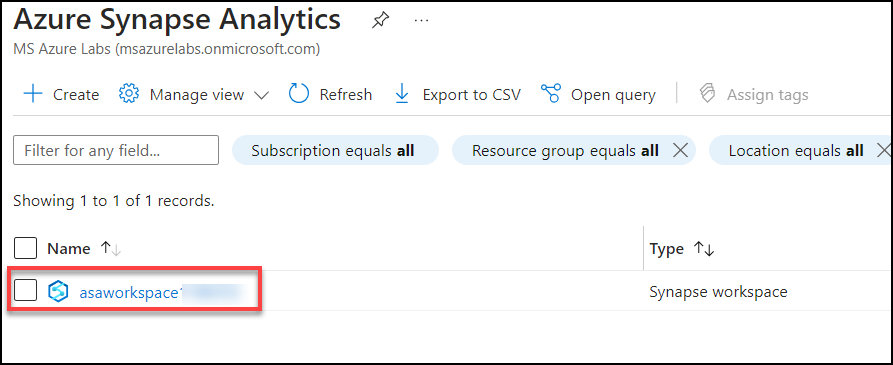
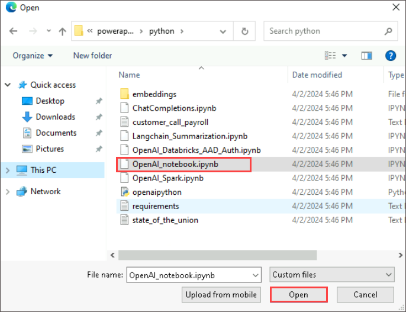
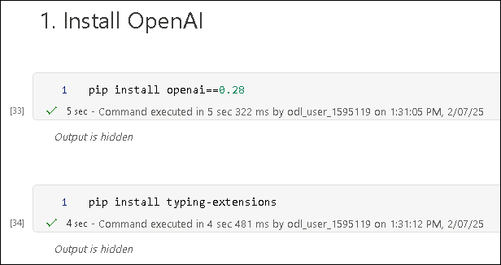
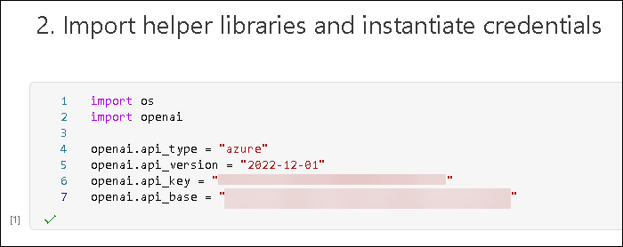
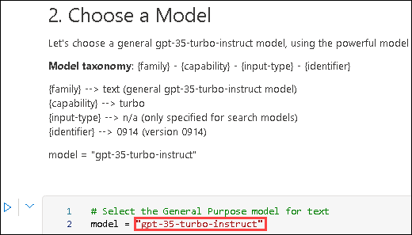
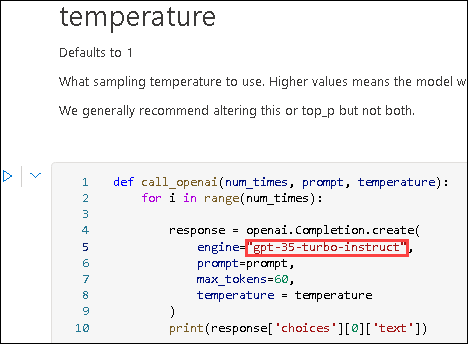
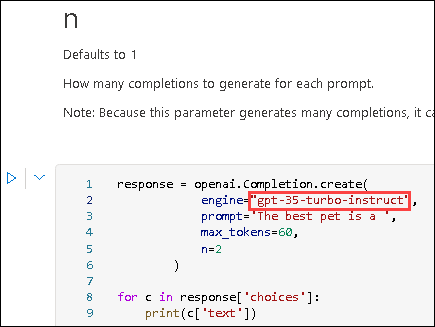
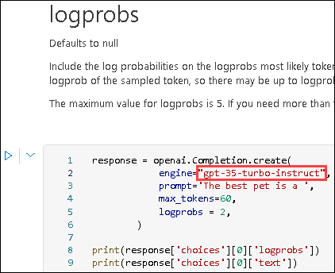

# Exercise 4: Build Open AI application with Python

## Overview

In this exercise, You'll be using Python to develop applications powered by OpenAI. This session is perfect for enhancing your programming skills and understanding how OpenAI can be utilized through Python.

1. Search for Synapse and select **Azure Synapse Analytics** in the Azure portal.

   

1. Click on **asaworkspace<inject key="DeploymentId"></inject>** to open.

    

1. On the **Overview** blade under **Getting started** section, click **Open** to open Synapse Studio.
     
    
    
1. Click on **Develop (1)** then click on **+ (2)** and select **Import**.

    

1. Navigate to `C:\labfile\OpenAIWorkshop\scenarios\powerapp_and_python\python` location and select `OpenAI_notebook.ipynb`, then click on **Open**.

     

1. Select **openaisparkpool** from the drop-down menu of **Attach to**.

    

    >**Note**: Use the three ellipsis(...) button at the top right corner of your browser to zoom out the page, allowing you to view the **Attach to** option.
    
1. In **1. Install OpenAI**, click on the **Run** button next to the two cells, and please wait till commands are executed. 

     

1. In **2. Import helper libraries and instantiate credentials** replace the **AZURE_OPENAI_API_KEY** with **<inject key="OpenAIKey" enableCopy="true"/>** and **AZURE_OPENAI_ENDPOINT** with **<inject key="OpenAIEndpoint" enableCopy="true"/>** and Run the cell.

     
   
     > **Note:** If you encounter an error "Openai module not found", enter `%` in before the **pip install** in the Install OpenAI cell and re-run the notebook again.

1. For **2. Choose a Model**, replace **model** value from **gpt-35-turbo-instruct** to **demomodel** and Run the cell.

     

1. In **temperature**, replace **engine** value from **gpt-35-turbo-instruct** to **demomodel** and Run the cell.

      

1. In **top_p**, replace **engine** value from **gpt-35-turbo-instruct** to **demomodel** and Run the cell.

      

1. For **n**, replace **engine** value from **gpt-35-turbo-instruct** to **demomodel** and Run the cell.

      

1. In **logprobs**, replace **engine** value from **gpt-35-turbo-instruct** to **demomodel** and Run the cell.

      

1. After running the notebook successfully, click on **Publish all**.

     

1. Then click on **Publish** to save the changes. 

    

## Summary

With the help of this exercise, you were able to improve your programming abilities and gain an understanding of how to use OpenAI with Python to create apps.

### You have successfully completed the lab!
