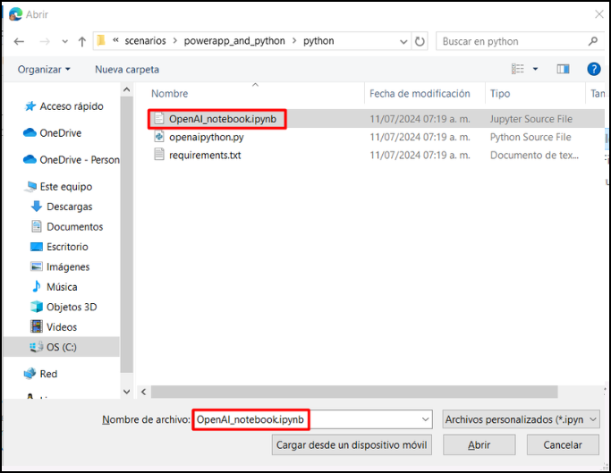
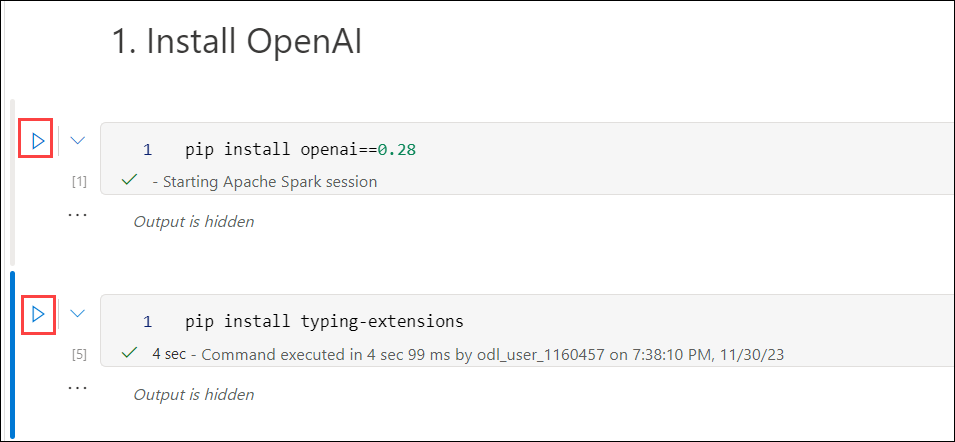
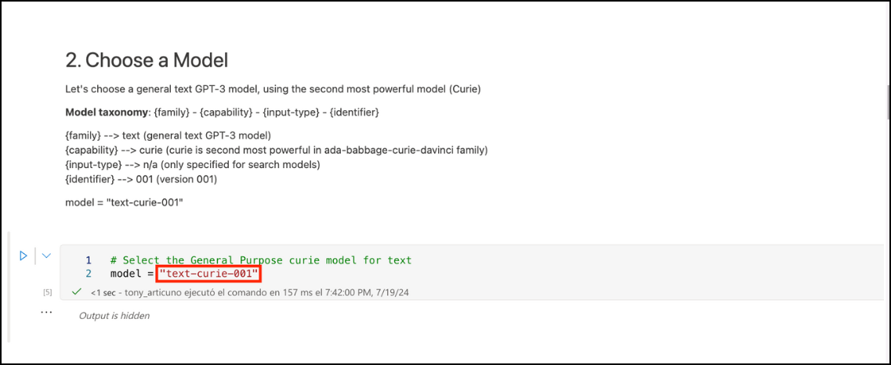
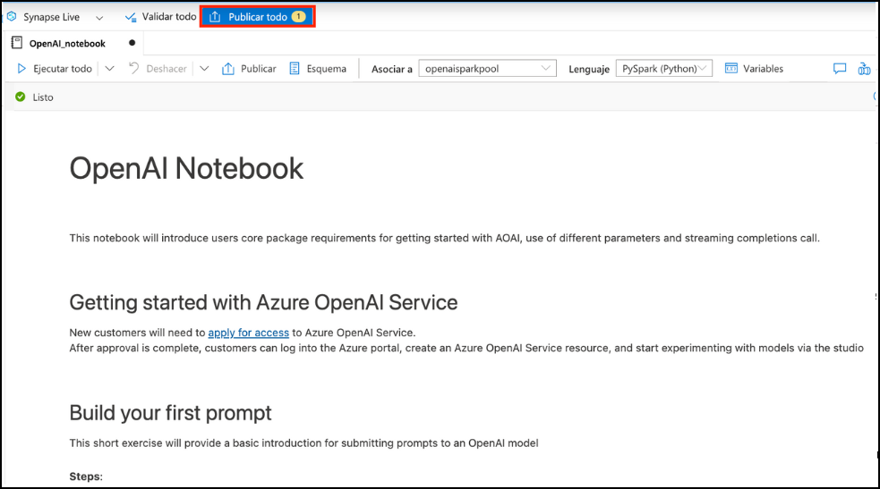
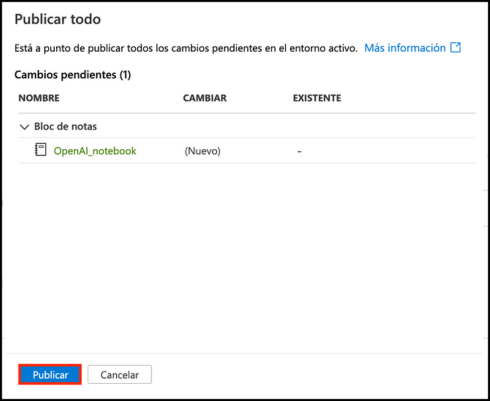

# Exercise 4: Build Open AI application with Python

In this exercise, You'll be using Python to develop applications powered by OpenAI. This session is perfect for enhancing your programming skills and understanding how OpenAI can be utilized through Python.

1. Search and select **Azure Synapse Analytics** in the Azure portal.

      

1. Click on **asaworkspace<inject key="DeploymentId"></inject>** to open.

    

1. On the **Overview** blade under **Getting started** section, click **Open** to open Synapse Studio.
     
    
    
1. Click on **Develop (1)** then click on **+ (2)** and select **Import**.

    

1. Navigate to `C:\labfile\OpenAIWorkshop\scenarios\powerapp_and_python\python` location and select `OpenAI_notebook.ipynb`, then click on **Open**.

     

1. Select **openaisparkpool** from the drop-down menu of **Attach to**.

    

1. In **1. Install OpenAI**, click on the **Run** button next to the two cells, and please wait till **Apache Spark pools** turn to stop state. 

     

1. In **2. Import helper libraries and instantiate credentials** replace the **AZURE_OPENAI_API_KEY** with **<inject key="OpenAIKey" enableCopy="true"/>** and **AZURE_OPENAI_ENDPOINT** with **<inject key="OpenAIEndpoint" enableCopy="true"/>**.

     
   
     > **Note:** If you encounter an error "Openai module not found", enter `%` in before the **pip install** in the Install OpenAI cell and re-run the notebook again.

1. For **2. Choose a Model**, replace **model** value from **text-curie-001** to **demomodel**.

    

1. In **temperature**, replace **engine** value from **text-curie-001** to **demomodel**.

     

1. In **top_p**, replace **engine** value from **text-curie-001** to **demomodel**.

     

1. For **n**, replace **engine** value from **text-curie-001** to **demomodel**.

     

1. In **logprobs**, replace **engine** value from **text-curie-001** to **demomodel**.

     

1. After running the notebook successfully, click on **Publish all**.

     

1. Then click on **Publish** to save the changes. 

    

**Summary:** With the help of this exercise, you were able to improve your programming abilities and gain an understanding of how to use OpenAI with Python to create apps.
