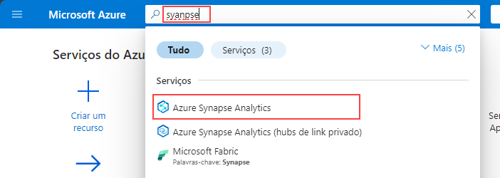
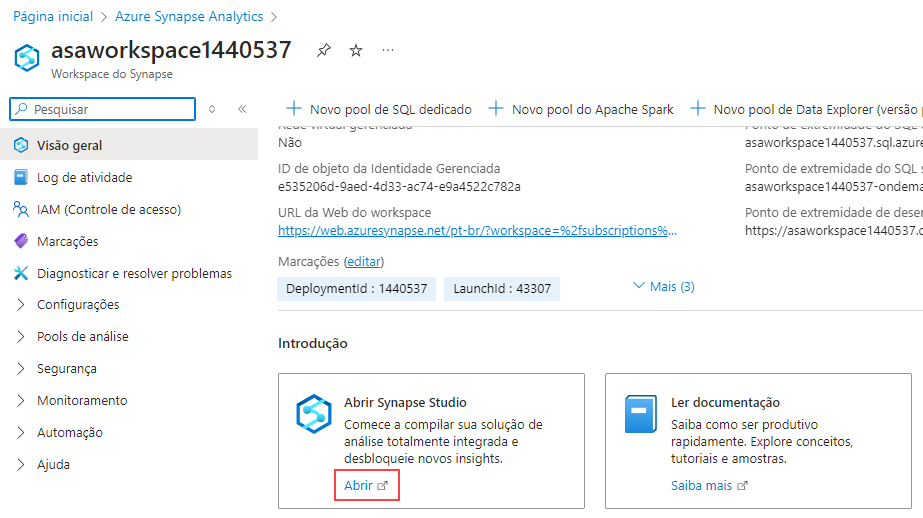
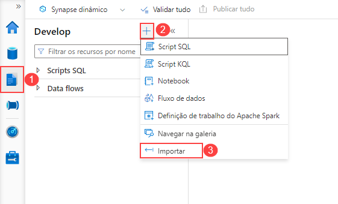

# Exercise 3: Build an Open AI application with Python

1. Pesquise e selecione **Azure Synapse Analytics** no portal do Azure.

      

1. Na janela **Azure Synapse Analytics** selecione **asaworkspace<inject key="DeploymentID" enableCopy="false"/>**.   

1. Na lâmina **Visão geral** na seção **Começando**, clique em **Abrir** para abrir o Synapse Studio.
     
     
    
1. Clique em **Desenvolver (1)**, depois clique em **+ (2)** e selecione **Importar (3)**.

    

1. Navegue até o local `C:\labfile\OpenAIWorkshop\scenarios\powerapp_and_python\python` e selecione `OpenAI_notebook.ipynb` e clique em **Abrir**.

1. Selecione **openaisparkpool** no menu suspenso de **Anexar a**.

    

1. Execute o notebook passo a passo para concluir este exercício. Clique no botão **Run** ao lado da célula.

     

1. Em **1. Install OpenAI**, clique no botão **Executar** ao lado das primeiras células e clique em **parar sessão**. Aguarde até que os **pools Apache Spark** passem para o estado de parada. 

     

      > **Note**: Pode ser necessário reiniciar o kernel para usar os pacotes atualizados

1. Em **2. Import helper libraries and instantiate credentials** e substitua **AZURE_OPENAI_API_KEY** e **AZURE_OPENAI_ENDPOINT** pela sua chave de API e URL do endpoint.

     
   
1. No Portal do Azure, navegue até o grupo de recursos **openaicustom-<inject key="DeploymentID" enableCopy="false"/>** e selecione o recurso **openai-<inject key="DeploymentID" enableCopy="false"/>** do Azure OpenAI.

    .png)

1. Em Gerenciamento de Recursos, selecione **Chaves e Endpoint (1)** e clique em **Mostrar Chaves (2)**. Copie **Chave 1 (3)** e **Ponto final (4)** e substitua **AZURE_OPENAI_API_KEY** e **AZURE_OPENAI_ENDPOINT** pela sua chave de API e URL do Endpoint no script.

   .png)
     
    > **Note:** Se você encontrar o erro "Módulo Openai não encontrado", digite `%` antes de **pip install** na célula Instalar OpenAI e execute o notebook novamente.

1. Para **2. Escolha um modelo** e substitua o valor do **modelo** de **text-curie-001** para **demomodel**.

    

1. Em **temperatura**, substitua o valor **motor** de **text-curie-001** para **demomodel**.

     

1. Em **top_p**, substitua o valor **engine** de **text-curie-001** para **demomodel**.

     

1. Para **n**, substitua o valor **engine** de **text-curie-001** para **demomodel**.

     

1. Em **logprobs**, substitua o valor **engine** de **text-curie-001** para **demomodel**.

     

1. Depois de executar o notebook com sucesso, clique em **Publicar tudo**.

     

1. Em seguida, clique em **Publicar** para salvar as alterações.

    

   <validation step="25c1c315-a610-4974-ae83-c5b3983d798e" />
