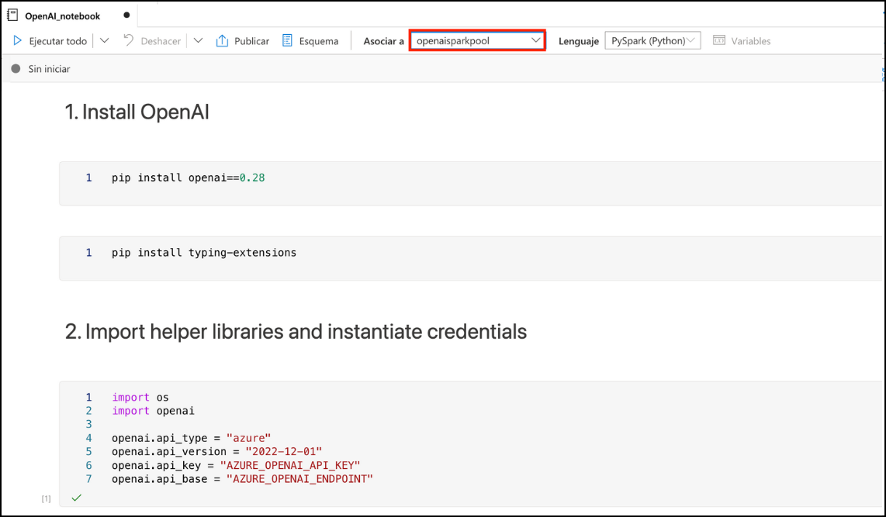
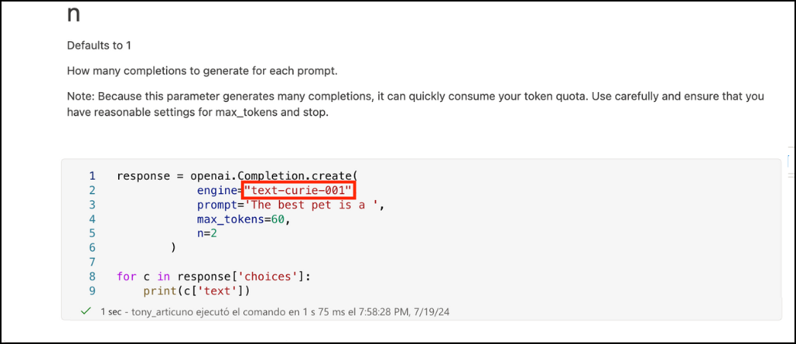

# Exercise 3: Build an Open AI application with Python

### Estimated Duration: 60 minutes

In this lab, participants will develop an application using OpenAI's APIs and Python programming language. The goal is to demonstrate how to implement AI functionalities such as language generation, sentiment analysis, or recommendation systems using Python, leveraging OpenAI's powerful models and tools.

1. Search and select **Azure Synapse Analytics** in the Azure portal.

      

1. On **Azure Synapse Analytics** window select **asaworkspace<inject key="DeploymentID" enableCopy="false"/>**.   

1. On the **Overview** blade under the **Getting started** section, click **Open** to open Synapse Studio.
     
     
    
1. Click on **Develop (1)**, then click on **+ (2)**, and select **Import**.

    

1. Navigate to the `C:\labfile\OpenAIWorkshop\scenarios\powerapp_and_python\python` location and select `OpenAI_notebook.ipynb`, then click on **Open**.

     

1. Select **openaisparkpool** from the drop-down menu of **Attach to**.

    

1. Run the notebook step-by-step to complete this exercise. Click on the **Run** button next to the cell.

     

1. In **1. Install OpenAI**, click on the **Run** button next to the first cells, and click on the **stop session**. Please wait till **Apache Spark pools** turn to stop state. 

     

      > **Note**: you may need to restart the kernel to use updated packages

1. In **2. Import helper libraries and instantiate credentials**, and replace the **AZURE_OPENAI_API_KEY** and **AZURE_OPENAI_ENDPOINT** with your API key and endpoint URL.

     
   
1. From Azure Portal, navigate to the **openaicustom-<inject key="DeploymentID" enableCopy="false"/>** resource group, and select the **asaworkspace<inject key="DeploymentID" enableCopy="false"/>** Azure OpenAI resource.

    

1. Under Resource Management, select **Keys and Endpoint (1)**, and click **Show Keys (2)**. Copy **Key 1 (3)** and **Endpoint (4)**, and replace the **AZURE_OPENAI_API_KEY** and **AZURE_OPENAI_ENDPOINT** with your API key and Endpoint URL in the script.

   
     
    > **Note:** If you encounter an error "Openai module not found", enter `%` in before the **pip install** in the Install OpenAI cell and re-run the notebook again.

1. For **2. Choose a Model**, and replace the **model** value from **text-curie-001** to **demomodel**.

    

1. In **temperature**, replace **engine** value from **text-curie-001** to **demomodel**.

     

1. In **top_p**, replace **engine** value from **text-curie-001** to **demomodel**.

     

1. For **n**, replace **engine** value from **text-curie-001** to **demomodel**.

     

1. In **logprobs**, replace **engine** value from **text-curie-001** to **demomodel**.

     

1. After running the notebook successfully, click on **Publish all**.

     

1. Then click on **Publish** to save the changes. 

    
